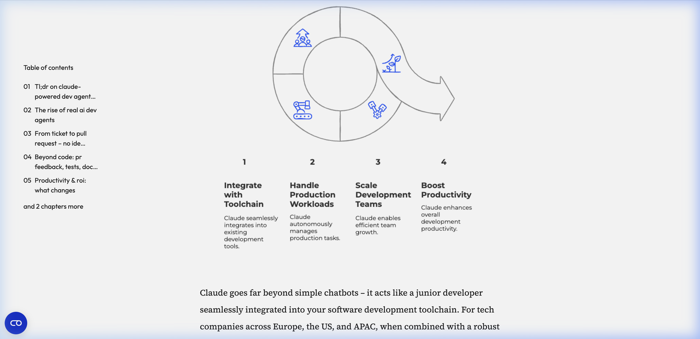
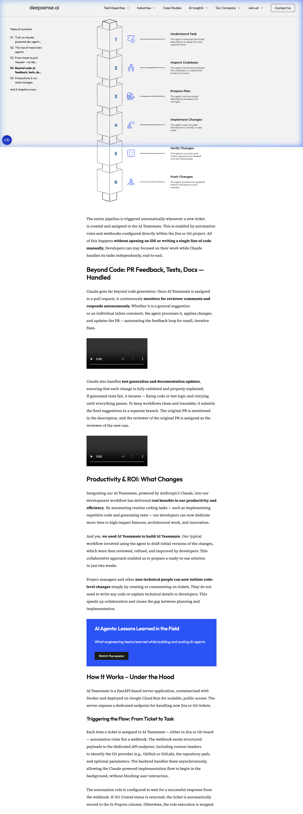

# Product Design Requirements (PDR): Autonomous AI Development Agent

## 1. Executive Summary
This document outlines the Product Design Requirements (PDR) for developing a fully functional, autonomous AI coding agent (often referred to as an "AI Teammate"). Inspired by industry best practices and leading implementations, this agent acts as an autonomous junior developer capable of reading requirements from issue trackers (Jira/Git), planning implementations, writing code, running tests, fixing errors, and submitting Pull Requests (PRs)—all without requiring human intervention in the IDE.

## 2. Product Vision & Goals
**Vision:** To build an autonomous software development agent that bridges the gap between project planning (ticket assignment) and technical implementation (Pull Requests) to maximize engineering productivity.

**Goals:**
- Automate repetitive coding, testing, and documentation tasks.
- Enable end-to-end task execution from ticket assignment to PR creation seamlessly.
- Automatically respond to PR reviewer feedback and self-correct failing tests.
- Maintain high code quality using iterative self-correction loops without human holding its hand.

## 3. Core Capabilities & Workflows

### 3.1. Issue Tracking Integration (The Trigger)
- **Webhook Listeners:** The agent must expose a dedicated endpoint (e.g., via FastAPI) to listen for task assignment events from Jira or Git platforms (GitHub/GitLab).
- **Context Extraction:** Upon receiving a payload, the agent must extract ticket descriptions, constraints, acceptance criteria, and project context.
- **Status Syncing:** Automatically update ticket statuses (e.g., move to "In Progress" once the webhook payload is acknowledged and processed).
- **Async Processing:** The endpoint must respond immediately (e.g., `201 Created`) and process the heavy generation logic asynchronously in the background.

### 3.2. Repository Operations & Codebase Mapping
- **Cloning & Branching:** Dynamically clone the target repository and create a new feature branch off `main`.
- **Semantic Mapping:** Utilize an AI-assisted coding framework (such as `aider`) to generate an architectural/semantic map of the codebase, cataloging key files, class definitions, function signatures, and context.
- **Planning:** Formulate a step-by-step implementation plan identifying which files need modification or creation before writing any code.

### 3.3. AI-Powered Code Generation
- **LLM Engine Integration:** Use advanced reasoning models (specifically Anthropic’s Claude 3.7 Sonnet or Claude-4) due to their large context windows, low hallucination rates, and superior iterative reasoning.
- **Prompt Injection:** Supply the LLM with a comprehensive prompt containing:
  - The ticket context.
  - The repository semantic map.
  - The detailed implementation plan.
  - Strict coding instructions (clean code principles, performance rules, and instructions to avoid placeholders like TODOs).
- **Iterative Implementation:** Implement changes incrementally using structured reasoning steps.

### 3.4. Validation & Self-Correction (The Retry Loop)
- **Local Verification:** Run repository-defined linters and test suites against the newly generated code.
- **Self-Healing Loop:** If errors, failing tests, or linter warnings are detected, capture the error output, feed it back to the Claude LLM as structured feedback, and prompt it to resolve the issues automatically. The loop continues until all checks pass.

### 3.5. Delivery & Collaboration (Pull Requests)
- **PR Creation:** Once validated, commit the code, push the new branch to the remote repository, and open a Pull Request.
- **Context Preservation:** Use the original ticket information to populate the PR title and description for traceability. Add an indication/label (e.g., `ai-generated`) to the PR.
- **Review Assignment:** Automatically assign the original ticket reporter or designated tech leads as reviewers.
- **Feedback Loop:** Monitor the PR for inline and general comments. Autonomously address feedback by updating code, fixing tests/docs, and pushing new commits to iterate on the PR.

## 4. System Architecture

### 4.1. Infrastructure & Backend
- **Framework:** FastAPI-based Python server for high-performance async webhook handling.
- **Containerization:** Dockerized application for environment consistency and easy deployment.
- **Hosting:** Scalable, serverless container platform (e.g., Google Cloud Run) to handle multiple asynchronous ticketing tasks concurrently.

### 4.2. Tooling SDKs & Integrations
- **Code Engine:** `aider` framework for codebase mapping and structured agentic coding execution.
- **Git Operations:** `PyGitHub` for GitHub interactions and `python-gitlab` for GitLab interactions.
- **LLM Provider:** Anthropic API (Claude 3.7 Sonnet / Claude 4.0).

## 5. Non-Functional Requirements
- **Security:** API keys (Anthropic, Git SDKs), access tokens, and Git credentials must be securely managed (e.g., via secure vaults or Cloud Secret Manager).
- **Isolated Execution:** Code execution, testing, and cloning should happen in secure, temporary directories or isolated containers to prevent cross-contamination between tasks.
- **Traceability:** Ensure all actions performed by the AI agent are properly logged and trackable back to the original task request.

## 6. Implementation Roadmap
- **Phase 1: Foundation.** Set up the FastAPI server, webhook listeners (Jira/GitHub), and basic Git API (PyGitHub/python-gitlab) communication logic.
- **Phase 2: The Agent Core.** Integrate Anthropic's Claude API and the `aider` framework. Implement codebase semantic mapping and the planning prompt.
- **Phase 3: The Validation Loop.** Implement execution of linters/tests in the pipeline and the LLM self-correction error-retry loop.
- **Phase 4: Feedback & Collaboration.** Enable webhook listening for PR comments to trigger iterative code refinement based on human feedback.
- **Phase 5: Deployment & Optimization.** Dockerize the entire service, deploy to a cloud provider, and run real-world benchmark tickets to fine-tune the system prompts.
