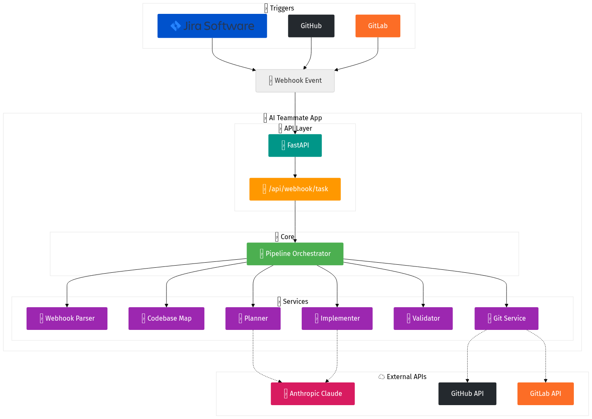
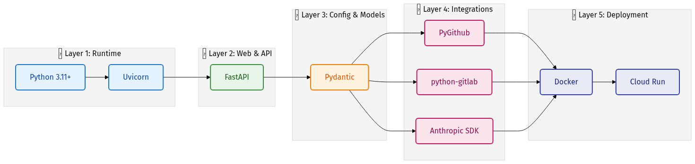

<div align="center">


# 🚀 AI Teammate (ai-dev-agent)

**From Jira/Git ticket to code, tests, and Pull Request — fully automated.**

[](https://www.python.org/)
[](https://fastapi.tiangolo.com/)
[](https://www.anthropic.com/)
[](https://www.docker.com/)

</div>

---

## 🔮 Description

**AI Teammate** is an **autonomous software development agent** that acts as a junior developer in your toolchain. It listens for task assignments (Jira or GitHub/GitLab issues), clones the target repository, maps the codebase, plans changes, implements them using Anthropic's Claude, runs linters and tests with self-correction, then commits, pushes, and opens a Pull Request — **all without human-in-the-loop coding.**

> [!TIP]
> **Core value:** Bridge project planning (ticket assignment) and technical implementation (PR creation) to increase engineering throughput while keeping code quality high.

* 🎯 **Trigger:** Webhook on ticket assignment (Jira, GitHub, or GitLab).
* ⚡ **Execution:** Asynchronous; the API returns `201 Created` immediately and runs the pipeline in the background.
* 📦 **Output:** A PR with the original ticket context, `ai-generated` label, and optional reviewer assignment.

> [!NOTE]
> See `AI_Agent_PDR.md` and `AGENT_FUNCTIONAL_PLAN.md` for product and functional design. Credentials and env setup: `agent/README_CREDENTIALS.md`. Step-by-step **which .py files run and in what order**: `agent/FLOW_PY_FILES.md`.

---

## 🏛️ Architecture

High-level: a **FastAPI** server exposes webhook endpoints; a **pipeline** orchestrates `clone → map → plan → implement → validate → deliver (commit/push/PR)`. Git and LLM are abstracted behind services.

```text
┌─────────────────────────────────────────────────────────────────────────────┐
│                           External systems                                  │
│  Jira / GitHub / GitLab  ──webhook──►  AI Teammate  ──clone/push/PR──►  Git │
│                                              │                              │
│                                              ▼                              │
│                                        Anthropic Claude                     │
└─────────────────────────────────────────────────────────────────────────────┘
                                         │
                                         ▼
┌─────────────────────────────────────────────────────────────────────────────┐
│  FastAPI app (agent/src)                                                    │
│  ├── 🌐 API:  /api/health,  /api/webhook/task,  /api/webhook/pr-comment   │
│  ├── ⚙️ Core: pipeline (orchestration)                                    │
│  ├── 🛠️ Services: webhook_parser, codebase_map, planner, implementer,      │
│  │             validator, git (clone/commit/push + GitHub provider)         │
│  ├── 📦 Models: TaskContext, ImplementationPlan, events                     │
│  └── 🔐 Config: settings from .env (tokens, model, timeouts)                │
└─────────────────────────────────────────────────────────────────────────────┘
```

* **Webhook layer:** Parses provider (GitHub/GitLab), repo, ticket; enqueues work; returns `201`; idempotency by ticket+repo.
* **Repo layer:** Clone (isolated temp dir), create feature branch, optional semantic map (file tree + symbols).
* **Agent layer:** Plan (Claude) from task + map; implement (Claude + `EDIT_FILE` applier); validate (linter + tests, retry with feedback).
* **Delivery layer:** Commit, push, create PR via PyGitHub / python-gitlab.

---

## 🛠️ Tech Stack & Versions

| Layer | Technology | Version / Note |
| :--- | :--- | :--- |
| **🏎️ Runtime** | Python | 3.11+ |
| **🌐 Web** | FastAPI | ≥0.115, <0.116 |
| **⚙️ ASGI server**| Uvicorn | ≥0.32, <0.33 |
| **🎛️ Config** | Pydantic Settings | ≥2.6, <3 |
| **📦 Models** | Pydantic | ≥2.9, <3 |
| **🐙 Git (GitHub)**| PyGithub | ≥2.4, <3 |
| **🦊 Git (GitLab)**| python-gitlab | ≥4.5, <5 |
| **🧠 LLM** | Anthropic API | anthropic ≥0.39; Claude 3.7 Sonnet / 4.x |
| **🐳 Deployment** | Docker, Cloud Run | Optional |

> All listed versions are from `agent/requirements.txt` and `agent/pyproject.toml`.

### 🏗️ Architecture & Tech Stack Diagram

**System architecture** — from triggers through the app to external APIs:

<div align="center">
  
</div>

**Tech stack layers** — from runtime to deployment:

<div align="center">
  
</div>

---

## 🌊 Flow Diagram

End-to-end flow from webhook to PR:


**Phases:**
1. 🎯 **Trigger:** `POST /api/webhook/task` (GitHub/GitLab issue payload or headers + body).
2. 🌿 **Clone & branch:** Isolated workspace, feature branch `ai/<ticket-slug>`.
3. 🗺️ **Map:** File tree + key symbols (Python/JS/TS) for context.
4. 🧠 **Plan:** One Claude call → list of file actions (create/modify/delete) and reasons.
5. 👷 **Implement:** Claude outputs `EDIT_FILE` blocks; agent applies edits in workspace.
6. 🔬 **Validate:** Run repo linter and tests; on failure, send feedback to Claude and re-implement (self-heal loop, configurable max retries).
7. 🚀 **Deliver:** Commit, push, create PR (title/body from ticket, label, reviewer).
8. 🧹 **Cleanup:** Remove workspace; release idempotency lock.

---

## 📥 Installation

### Prerequisites
* 🍎 **macOS** (or 🐧 Linux) with **Python 3.11+** and **git**
* *Optional:* **GitHub** or **GitLab** repo and tokens for full flow

### 🚀 Option 1: One-shot setup + server
From the repo root:
```bash
cd /path/to/Agents-1
python setup.py runserver
```
This will:
* Create `agent/.venv` if missing.
* Install dependencies into that venv.
* Ensure a writable workspace (`agent/workspaces`).
* Start the server on `http://localhost:8000`.

> [!IMPORTANT]
> Secrets (`GITHUB_TOKEN`, `ANTHROPIC_API_KEY`, etc.) must still be set in `agent/.env`.

### ⚙️ Option 2: Manual setup

<details>
<summary><b>Click to expand manual setup instructions</b></summary>

1. **Clone and enter the agent directory**
   ```bash
   cd /path/to/Agents-1/agent
   ```

2. **Create and activate a virtual environment**
   ```bash
   python3 -m venv .venv
   source .venv/bin/activate   # On Windows: .venv\Scripts\activate
   ```

3. **Install dependencies**
   ```bash
   pip install --upgrade pip
   pip install -r requirements.txt
   ```

4. **Configure environment**
   ```bash
   cp .env.example .env
   ```
   Edit `.env`:
   - **Phase 1 only:** Use a public repo; leave `ANTHROPIC_API_KEY` empty.
   - **Full flow:** Set `GITHUB_TOKEN` (or `GITLAB_TOKEN`) and `ANTHROPIC_API_KEY`.

5. **Run the server**
   ```bash
   export PYTHONPATH="${PWD}"
   uvicorn src.main:app --reload --host 0.0.0.0 --port 8000
   ```
</details>

---

## 🧪 Local End-to-End Testing

Use the **standalone test runner** from repo root:

```bash
cd /path/to/Agents-1
python setup.py runserver   # First terminal (server)

# In a second terminal (ensure setup.py has been run once):
python test.py              # Automated health + webhook + PR-comment test
```

`test.py` will hit `GET /api/health`, `POST /api/webhook/task`, and `POST /api/webhook/pr-comment`, then print PASS/FAIL and stop the server.

<details>
<summary><b>Manual API Testing Guide</b></summary>

### 1️⃣ Health check
```bash
curl -s http://localhost:8000/api/health
```

### 2️⃣ Task webhook (GitHub-style payload)
Copy payload and replace placeholders:
```bash
cp agent/scripts/sample_payloads/webhook_task_github.json /tmp/my_webhook.json
# Edit: replace YOUR_GITHUB_USERNAME and YOUR_REPO_NAME
```

Send the webhook:
```bash
curl -s -w "\nHTTP_CODE:%{http_code}\n" -X POST http://localhost:8000/api/webhook/task \
  -H "Content-Type: application/json" \
  -d @/tmp/my_webhook.json
```
**Expected:** HTTP **201**.

### 3️⃣ PR comment webhook (stub)
```bash
curl -s -w "\nHTTP_CODE:%{http_code}\n" -X POST http://localhost:8000/api/webhook/pr-comment \
  -H "Content-Type: application/json" \
  -d '{"comment":{"body":"Please add a test"},"repository":{"full_name":"owner/repo"},"pull_request":{"number":1}}'
```
Expected: HTTP **202** (stub response).
</details>

### 🔌 Endpoints Quick Reference

| Action | Method | URL | Expected |
| :--- | :---: | :--- | :---: |
| 🟢 **Health** | GET | `/api/health` | `200` |
| 📥 **Task Webhook** | POST | `/api/webhook/task` | `201` (or 400/409) |
| 💬 **PR Comment** | POST | `/api/webhook/pr-comment` | `202` |

---

## 📂 Project Layout

```text
agent/
├── 📁 src/
│   ├── 🐍 main.py              # FastAPI app
│   ├── 📁 config/              # Settings (env)
│   ├── 📁 api/routes/          # health, webhooks
│   ├── 📁 core/                # pipeline
│   ├── 📁 models/              # task, plan, events
│   ├── 📁 services/            # webhook parser, codebase map, planner, implementer...
│   └── 📁 utils/               # logging, idempotency
├── 📁 scripts/sample_payloads/ # sample webhook JSON
├── 📄 requirements.txt
├── 📄 pyproject.toml
├── 📄 .env.example
├── 📄 README_CREDENTIALS.md
├── 📄 FLOW_PY_FILES.md        # Step-by-step: which .py files run, start → end
└── 🐳 Dockerfile
```

---

## 🐳 Docker (Optional)

From repo root:
```bash
docker build -f agent/Dockerfile agent/
docker run -p 8000:8000 -e GITHUB_TOKEN=xxx -e ANTHROPIC_API_KEY=xxx <image-id>
```

---

## 🔐 Security & Validation

A sample webhook payload for testing against **[machhakiran/Agents-1](https://github.com/machhakiran/Agents-1)** is at `agent/scripts/sample_payloads/webhook_task_machhakiran_agents1.json`.

After configuring `agent/.env` run validation:
```bash
cd agent
source .venv/bin/activate
export PYTHONPATH="${PWD}"
bash scripts/validate_and_test.sh
```

> [!CAUTION]
> **Security:** Do not commit `agent/.env`. If you ever expose API keys, rotate them immediately in [GitHub Settings](https://github.com/settings/tokens) and [Anthropic Console](https://console.anthropic.com/).

---

<div align="center">

## 📄 Copyright & License

**Copyright © 2025 Machha Kiran. All rights reserved.**

📬 **Email:** [machhakiran@gmail.com](mailto:machhakiran@gmail.com)  
💼 **LinkedIn:** [linkedin.com/in/machhakiran](https://www.linkedin.com/in/machhakiran/)  
🐙 **GitHub:** [github.com/machhakiran](https://github.com/machhakiran)

*This project is provided as-is for evaluation and development. Use of third-party services (Anthropic, GitHub, GitLab) is subject to their respective terms and policies.*

</div>
