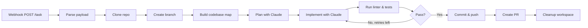

# AI Teammate — Autonomous AI Development Agent

**Project name:** AI Teammate (ai-dev-agent)  
**Tagline:** From Jira/Git ticket to code, tests, and Pull Request — fully automated.

---

## Description

AI Teammate is an **autonomous software development agent** that acts as a junior developer in your toolchain. It listens for task assignments (Jira or GitHub/GitLab issues), clones the target repository, maps the codebase, plans changes, implements them using Anthropic’s Claude, runs linters and tests with self-correction, then commits, pushes, and opens a Pull Request — all without human-in-the-loop coding.

**Core value:** Bridge project planning (ticket assignment) and technical implementation (PR creation) to increase engineering throughput while keeping code quality high.

- **Trigger:** Webhook on ticket assignment (Jira, GitHub, or GitLab).
- **Execution:** Asynchronous; the API returns `201 Created` immediately and runs the pipeline in the background.
- **Output:** A PR with the original ticket context, `ai-generated` label, and optional reviewer assignment.

See [AI_Agent_PDR.md](AI_Agent_PDR.md) and [AGENT_FUNCTIONAL_PLAN.md](AGENT_FUNCTIONAL_PLAN.md) for product and functional design. Credentials and env setup: [agent/README_CREDENTIALS.md](agent/README_CREDENTIALS.md).

---

## Architecture

High-level: a **FastAPI** server exposes webhook endpoints; a **pipeline** orchestrates clone → map → plan → implement → validate → deliver (commit/push/PR). Git and LLM are abstracted behind services.

```
┌─────────────────────────────────────────────────────────────────────────────┐
│                           External systems                                   │
│  Jira / GitHub / GitLab  ──webhook──►  AI Teammate  ──clone/push/PR──►  Git  │
│                                              │                               │
│                                              ▼                               │
│                                        Anthropic Claude                      │
└─────────────────────────────────────────────────────────────────────────────┘
                                         │
                                         ▼
┌─────────────────────────────────────────────────────────────────────────────┐
│  FastAPI app (agent/src)                                                     │
│  ├── API:  /api/health,  /api/webhook/task,  /api/webhook/pr-comment         │
│  ├── Core: pipeline (orchestration)                                          │
│  ├── Services: webhook_parser, codebase_map, planner, implementer,           │
│  │             validator, git (clone/commit/push + GitHub/GitLab provider)   │
│  ├── Models: TaskContext, ImplementationPlan, events                         │
│  └── Config: settings from .env (tokens, model, timeouts)                     │
└─────────────────────────────────────────────────────────────────────────────┘
```

- **Webhook layer:** Parses provider (GitHub/GitLab), repo, ticket; enqueues work; returns 201; idempotency by ticket+repo.
- **Repo layer:** Clone (isolated temp dir), create feature branch, optional semantic map (file tree + symbols).
- **Agent layer:** Plan (Claude) from task + map; implement (Claude + EDIT_FILE applier); validate (linter + tests, retry with feedback).
- **Delivery layer:** Commit, push, create PR via PyGitHub / python-gitlab.

---

## Tech stack and versions

| Layer        | Technology        | Version / note |
|-------------|-------------------|----------------|
| Runtime     | Python            | 3.11+          |
| Web         | FastAPI           | ≥0.115, &lt;0.116 |
| ASGI server | Uvicorn           | ≥0.32, &lt;0.33  |
| Config      | Pydantic Settings | ≥2.6, &lt;3       |
| Models      | Pydantic          | ≥2.9, &lt;3       |
| Git (GitHub)| PyGithub          | ≥2.4, &lt;3       |
| Git (GitLab)| python-gitlab     | ≥4.5, &lt;5       |
| LLM         | Anthropic API     | anthropic ≥0.39; Claude 3.7 Sonnet / 4.x |
| Deployment  | Docker, Cloud Run | Optional       |

All listed versions are from [agent/requirements.txt](agent/requirements.txt) and [agent/pyproject.toml](agent/pyproject.toml).

---

## Flow diagram

End-to-end flow from webhook to PR:



**Phases:**

1. **Trigger:** `POST /api/webhook/task` (GitHub/GitLab issue payload or headers + body).
2. **Clone & branch:** Isolated workspace, feature branch `ai/<ticket-slug>`.
3. **Map:** File tree + key symbols (Python/JS/TS) for context.
4. **Plan:** One Claude call → list of file actions (create/modify/delete) and reasons.
5. **Implement:** Claude outputs `EDIT_FILE` blocks; agent applies edits in workspace.
6. **Validate:** Run repo linter and tests; on failure, send feedback to Claude and re-implement (self-heal loop, configurable max retries).
7. **Deliver:** Commit, push, create PR (title/body from ticket, label, reviewer).
8. **Cleanup:** Remove workspace; release idempotency lock.

---

## Installation

### Prerequisites

- **macOS** (or Linux) with **Python 3.11+** and **git**
- Optional: **GitHub** or **GitLab** repo and tokens for full flow

### Steps

1. **Clone and enter the agent directory**

   ```bash
   cd /path/to/Agents-1/agent
   ```

2. **Create and activate a virtual environment**

   ```bash
   python3 -m venv .venv
   source .venv/bin/activate   # On Windows: .venv\Scripts\activate
   ```

3. **Install dependencies**

   ```bash
   pip install --upgrade pip
   pip install -r requirements.txt
   ```

   If you hit SSL/network issues:

   ```bash
   pip install -r requirements.txt --trusted-host pypi.org --trusted-host files.pythonhosted.org
   ```

4. **Configure environment**

   ```bash
   cp .env.example .env
   ```

   Edit `.env`:

   - **Phase 1 only (webhook + clone + branch):** Use a public repo; leave `ANTHROPIC_API_KEY` empty. Optionally set `GITHUB_TOKEN` for private clone.
   - **Full flow (through PR):** Set `GITHUB_TOKEN` (or `GITLAB_TOKEN`) and `ANTHROPIC_API_KEY`.

   See [agent/README_CREDENTIALS.md](agent/README_CREDENTIALS.md) for required vs optional variables.

5. **Run the server**

   ```bash
   export PYTHONPATH="${PWD}"
   uvicorn src.main:app --reload --host 0.0.0.0 --port 8000
   ```

   Server: `http://localhost:8000`. API docs: `http://localhost:8000/docs`.

---

## Local end-to-end testing (macOS)

Use a **second terminal** for the following; keep the server running in the first.

### 1. Health check

```bash
curl -s http://localhost:8000/api/health
```

Expected: `{"status":"ok","service":"ai-dev-agent"}`.

### 2. Task webhook (GitHub-style payload)

Use a real **owner/repo** (e.g. a public repo or one you can push to). A sample payload is in `agent/scripts/sample_payloads/webhook_task_github.json`. Copy and replace placeholders:

```bash
cp agent/scripts/sample_payloads/webhook_task_github.json /tmp/my_webhook.json
# Edit: replace YOUR_GITHUB_USERNAME and YOUR_REPO_NAME
```

Example payload shape:

```json
{
  "issue": {
    "number": 42,
    "title": "Add a README line",
    "body": "Add one line to README: Test from AI agent.",
    "labels": [{"name": "test"}],
    "assignees": [{"login": "your-github-username"}],
    "user": {"login": "your-github-username"}
  },
  "repository": {
    "full_name": "YOUR_GITHUB_USERNAME/YOUR_REPO_NAME",
    "default_branch": "main",
    "name": "YOUR_REPO_NAME",
    "owner": {"login": "YOUR_GITHUB_USERNAME"}
  }
}
```

Send the webhook:

```bash
curl -s -w "\nHTTP_CODE:%{http_code}\n" -X POST http://localhost:8000/api/webhook/task \
  -H "Content-Type: application/json" \
  -d @/tmp/my_webhook.json
```

**Expected:** HTTP **201**, body e.g. `{"status":"accepted","ticket_id":"#42","repo":"owner/repo"}`.

In the **server** terminal you should see: Webhook accepted → Pipeline started → Clone and branch ready (and, if no `ANTHROPIC_API_KEY`, “Phase 2 skipped”).

### 3. Full flow (optional)

With `GITHUB_TOKEN` and `ANTHROPIC_API_KEY` set, use the same webhook with a repo you can push to and a small, clear task. Logs should show: map built → plan created → implementation applied → validation passed → PR created. On GitHub: new branch and PR with `ai-generated` label.

### 4. PR comment webhook (stub)

```bash
curl -s -w "\nHTTP_CODE:%{http_code}\n" -X POST http://localhost:8000/api/webhook/pr-comment \
  -H "Content-Type: application/json" \
  -d '{"comment":{"body":"Please add a test"},"repository":{"full_name":"owner/repo"},"pull_request":{"number":1}}'
```

Expected: HTTP **202** (stub response).

### 5. Idempotency

Send the **same** task webhook again while the first run is still in progress. Expected: HTTP **409** and message that the task is already in progress for that ticket and repo.

### Endpoints quick reference

| What               | Method | URL                                   | Expected        |
|--------------------|--------|----------------------------------------|-----------------|
| Health             | GET    | `http://localhost:8000/api/health`      | 200, `{"status":"ok",...}` |
| Task webhook       | POST   | `http://localhost:8000/api/webhook/task` | 201 (or 400/409) |
| PR comment webhook | POST   | `http://localhost:8000/api/webhook/pr-comment` | 202             |

### Troubleshooting

| Problem | Check |
|--------|--------|
| **400** on `/webhook/task` | Valid JSON body; GitHub format needs `issue` + `repository`. |
| **409** | Same ticket+repo already in progress; wait or use another ticket/repo. |
| **Clone failed** | Repo exists, correct `full_name`, and (if private) valid `GITHUB_TOKEN`. |
| **Phase 2 skipped** | Set `ANTHROPIC_API_KEY` in `.env` for map/plan/implement. |
| **No PR** | Validation must pass; need Git token and successful Phase 2. |
| **Module not found** | Run from `agent/` and set `PYTHONPATH=${PWD}`. |

---

## Project layout (agent)

```
agent/
├── src/
│   ├── main.py              # FastAPI app
│   ├── config/              # Settings (env)
│   ├── api/routes/          # health, webhooks
│   ├── core/                # pipeline
│   ├── models/              # task, plan, events
│   ├── services/            # webhook_parser, codebase_map, planner, implementer,
│   │                        # validator, llm, git (clone, commit, push, provider)
│   └── utils/               # logging, idempotency
├── scripts/sample_payloads/ # sample webhook JSON
├── requirements.txt
├── pyproject.toml
├── .env.example
├── README_CREDENTIALS.md
└── Dockerfile
```

---

## Docker (optional)

From repo root:

```bash
docker build -f agent/Dockerfile agent/
docker run -p 8000:8000 -e GITHUB_TOKEN=xxx -e ANTHROPIC_API_KEY=xxx <image-id>
```

---

## Test repo and validation

A sample webhook payload for testing against **[machhakiran/Agents-1](https://github.com/machhakiran/Agents-1)** is at `agent/scripts/sample_payloads/webhook_task_machhakiran_agents1.json`.

After configuring `agent/.env` (see [agent/README_CREDENTIALS.md](agent/README_CREDENTIALS.md)):

```bash
cd agent
source .venv/bin/activate
export PYTHONPATH="${PWD}"
# Optional: run validation script (starts server, hits health + webhook, then exits)
bash scripts/validate_and_test.sh
```

Or run the server and send the webhook manually:

```bash
uvicorn src.main:app --reload --host 0.0.0.0 --port 8000
# In another terminal:
curl -X POST http://localhost:8000/api/webhook/task \
  -H "Content-Type: application/json" \
  -d @agent/scripts/sample_payloads/webhook_task_machhakiran_agents1.json
```

Then check [machhakiran/Agents-1](https://github.com/machhakiran/Agents-1) for the new branch and Pull Request.

**Security:** Do not commit `agent/.env`. If you ever exposed API keys (e.g. in chat or logs), rotate them in [GitHub Settings → Developer settings → Personal access tokens](https://github.com/settings/tokens) and [Anthropic Console](https://console.anthropic.com/).

---

## Copyright and license

Copyright © 2025 AI Teammate Project. All rights reserved.

This project is provided as-is for evaluation and development. Use of third-party services (Anthropic, GitHub, GitLab) is subject to their respective terms and policies.
