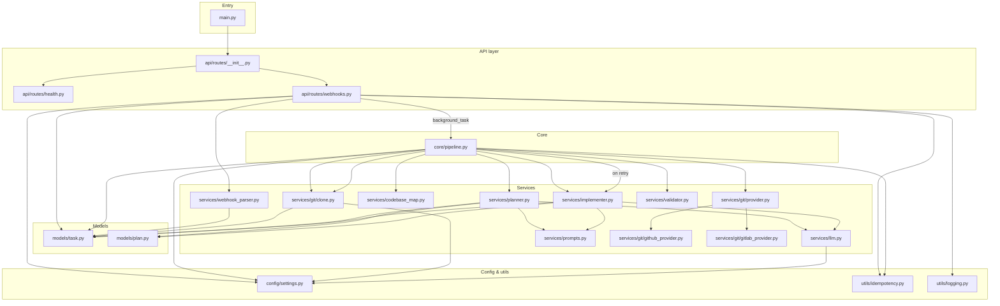
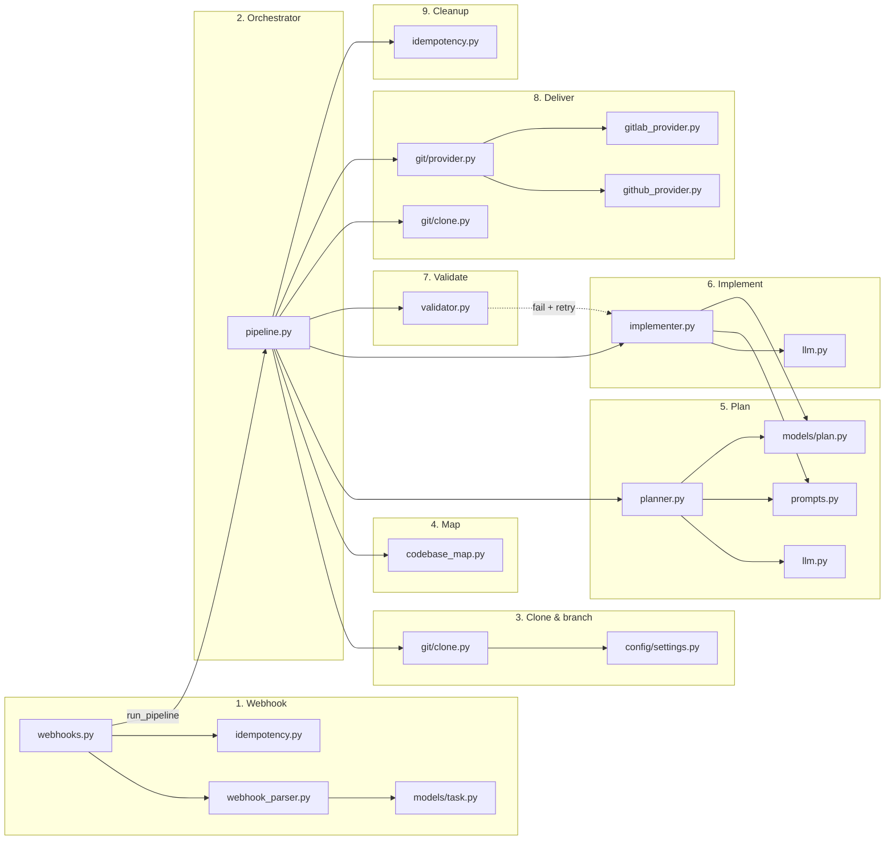
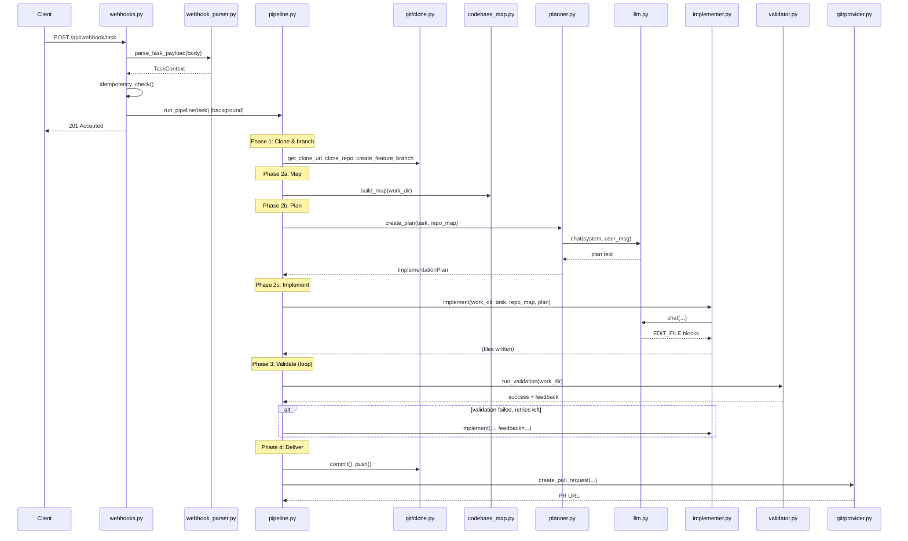

# Step-by-step flow: `.py` files in execution order

This document traces **which Python files run and in what order** from the moment the app starts until a task finishes (webhook → PR). Paths are relative to `agent/`.

---

## Flow diagrams (Mermaid)

### 1. Request → pipeline: which `.py` files run (arrow = calls/uses)



### 2. Pipeline phases: `.py` communication in order (left → right)



### 3. Sequence: one task from HTTP to PR (simplified)



---

## 1. Application start (entry point)

| Step | File | Role |
|------|------|------|
| 1.1 | **`src/main.py`** | Entry point. Loads config, sets up logging, creates FastAPI app, mounts API router. |

**Imports:** `src.config`, `src.utils.logging`, `src.api.routes`

---

## 2. API layer (incoming request)

| Step | File | Role |
|------|------|------|
| 2.1 | **`src/api/__init__.py`** | API package (if used). |
| 2.2 | **`src/api/routes/__init__.py`** | Defines `api_router`; includes health and webhook routers. |
| 2.3 | **`src/api/routes/health.py`** | `GET /api/health` → returns `{"status":"ok","service":"ai-dev-agent"}`. |
| 2.4 | **`src/api/routes/webhooks.py`** | **Task webhook:** `POST /api/webhook/task` — parses body, checks idempotency, enqueues pipeline. **PR-comment webhook:** `POST /api/webhook/pr-comment` (stub). |

**Config & models used by routes:**

| Step | File | Role |
|------|------|------|
| 2.5 | **`src/config/__init__.py`** | Exposes `get_settings`, `Settings`. |
| 2.6 | **`src/config/settings.py`** | Loads `.env`; defines `Settings` (tokens, timeouts, workspace_base, etc.). |
| 2.7 | **`src/models/task.py`** | `TaskContext`, `GitProvider`, `WebhookTaskPayload` — task data model. |
| 2.8 | **`src/utils/idempotency.py`** | `idempotency_check()` / `idempotency_release()` — prevent duplicate runs. |
| 2.9 | **`src/utils/logging.py`** | `log_task()`, `configure_logging()`. |

**Webhook parsing (called from webhooks.py):**

| Step | File | Role |
|------|------|------|
| 2.10 | **`src/services/webhook_parser.py`** | `parse_task_payload()` — GitHub/GitLab body → `WebhookTaskPayload`; uses **`src/models/task.py`**. |

**Pipeline trigger (from webhooks.py):**

| Step | File | Role |
|------|------|------|
| 2.11 | **`src/core/pipeline.py`** | `run_pipeline(task)` — invoked in background; orchestrates all steps below. |

---

## 3. Pipeline: clone & branch (Phase 1)

| Step | File | Role |
|------|------|------|
| 3.1 | **`src/core/pipeline.py`** | Calls `get_clone_url()`, `clone_repo()`, `create_feature_branch()`. |
| 3.2 | **`src/services/git/__init__.py`** | Re-exports clone helpers and provider. |
| 3.3 | **`src/services/git/clone.py`** | `get_clone_url(task)` (uses **`src/config/settings.py`** for token), `clone_repo()`, `create_feature_branch()`, later `commit()`, `push()`. |
| 3.4 | **`src/models/task.py`** | `TaskContext` passed into all git and pipeline steps. |

---

## 4. Pipeline: codebase map (Phase 2 start)

| Step | File | Role |
|------|------|------|
| 4.1 | **`src/core/pipeline.py`** | Calls `build_map(work_dir)`. |
| 4.2 | **`src/services/codebase_map.py`** | `build_map(work_dir)` — file tree + symbols (Python/JS/TS); no LLM. |

---

## 5. Pipeline: plan (Phase 2)

| Step | File | Role |
|------|------|------|
| 5.1 | **`src/core/pipeline.py`** | Calls `create_plan(task, repo_map)`. |
| 5.2 | **`src/services/planner.py`** | `create_plan()` — builds user message from task + map; calls LLM; parses plan. |
| 5.3 | **`src/services/llm.py`** | `chat(system, user_message)` — single Claude API call; uses **`src/config/settings.py`** for API key and model. |
| 5.4 | **`src/services/prompts.py`** | `PLANNING_SYSTEM`, `PLANNING_USER_TEMPLATE` — prompt text for planner. |
| 5.5 | **`src/models/plan.py`** | `ImplementationPlan`, `PlanStep` — plan structure returned by planner. |

---

## 6. Pipeline: implement (Phase 2)

| Step | File | Role |
|------|------|------|
| 6.1 | **`src/core/pipeline.py`** | Calls `implement(work_dir, task, repo_map, plan)` (and again with `feedback` on validation retry). |
| 6.2 | **`src/services/implementer.py`** | `implement()` — builds user message (task + map + plan + optional feedback); calls LLM; parses `EDIT_FILE` blocks; writes/patches files in workspace. |
| 6.3 | **`src/services/llm.py`** | `chat()` — Claude call for implementation. |
| 6.4 | **`src/services/prompts.py`** | `IMPLEMENTATION_SYSTEM`, `IMPLEMENTATION_USER_TEMPLATE`, `IMPLEMENTATION_FEEDBACK_APPENDIX`. |
| 6.5 | **`src/models/plan.py`** | `ImplementationPlan`, `PlanStep` — plan passed into implementer. |

---

## 7. Pipeline: validate (Phase 3)

| Step | File | Role |
|------|------|------|
| 7.1 | **`src/core/pipeline.py`** | Loop: `run_validation(work_dir)`; on failure, optionally calls `implement(..., feedback=...)` and retries. |
| 7.2 | **`src/services/validator.py`** | `run_validation(work_dir)` — runs repo linter/tests (e.g. script in repo or default); returns success + feedback for self-heal. |

---

## 8. Pipeline: deliver — commit, push, PR (Phase 4)

| Step | File | Role |
|------|------|------|
| 8.1 | **`src/core/pipeline.py`** | Checks `git status --porcelain`; calls `commit()`, `push()`, then `get_git_provider()` and `provider.create_pull_request()`. |
| 8.2 | **`src/services/git/clone.py`** | `commit(work_dir, message)`, `push(work_dir, branch_name)`. |
| 8.3 | **`src/services/git/provider.py`** | `GitProviderInterface`, `get_git_provider(provider)` — returns GitHub or GitLab implementation. |
| 8.4 | **`src/services/git/github_provider.py`** | GitHub: create PR, set label, request reviewers (PyGithub). |
| 8.5 | **`src/services/git/gitlab_provider.py`** | GitLab: create MR (python-gitlab). |

---

## 9. Pipeline: cleanup

| Step | File | Role |
|------|------|------|
| 9.1 | **`src/core/pipeline.py`** | `finally`: remove workspace dir; call `idempotency_release()`. |
| 9.2 | **`src/utils/idempotency.py`** | `idempotency_release(ticket_id, repo_full_name)`. |

---

## Linear flow summary (single task, start → end)

```
main.py
  → api/routes/__init__.py
  → api/routes/webhooks.py
       → config/settings.py
       → models/task.py
       → utils/idempotency.py
       → services/webhook_parser.py  (uses models/task.py)
       → core/pipeline.py
            → config/settings.py
            → models/task.py
            → services/git/clone.py       (get_clone_url, clone_repo, create_feature_branch)
            → services/codebase_map.py     (build_map)
            → services/planner.py          (create_plan)
                 → services/llm.py
                 → services/prompts.py
                 → models/plan.py
            → services/implementer.py      (implement)
                 → services/llm.py
                 → services/prompts.py
                 → models/plan.py
            → services/validator.py       (run_validation)
            → services/git/clone.py       (commit, push)
            → services/git/provider.py    (get_git_provider)
            → services/git/github_provider.py  or  gitlab_provider.py  (create_pull_request)
            → utils/idempotency.py        (idempotency_release)
```

---

## File index (all .py files involved)

| Path | Used in flow |
|------|----------------|
| `src/main.py` | Entry; starts app |
| `src/config/__init__.py` | Config package |
| `src/config/settings.py` | Env, tokens, timeouts |
| `src/api/__init__.py` | API package |
| `src/api/routes/__init__.py` | Router setup |
| `src/api/routes/health.py` | Health check |
| `src/api/routes/webhooks.py` | Task & PR-comment webhooks |
| `src/core/__init__.py` | Core package |
| `src/core/pipeline.py` | Orchestrator |
| `src/models/__init__.py` | Models package |
| `src/models/task.py` | TaskContext, WebhookTaskPayload |
| `src/models/plan.py` | ImplementationPlan, PlanStep |
| `src/models/events.py` | (if used for events) |
| `src/services/__init__.py` | Services package |
| `src/services/webhook_parser.py` | Parse webhook body |
| `src/services/codebase_map.py` | Build repo map |
| `src/services/planner.py` | Create plan (Claude) |
| `src/services/implementer.py` | Apply edits (Claude) |
| `src/services/validator.py` | Lint + tests |
| `src/services/llm.py` | Claude API |
| `src/services/prompts.py` | Prompt templates |
| `src/services/git/__init__.py` | Git exports |
| `src/services/git/clone.py` | Clone, branch, commit, push |
| `src/services/git/provider.py` | Git provider factory |
| `src/services/git/github_provider.py` | GitHub PR |
| `src/services/git/gitlab_provider.py` | GitLab MR |
| `src/utils/__init__.py` | Utils package |
| `src/utils/logging.py` | Logging config |
| `src/utils/idempotency.py` | Task lock |

`src/api/deps.py` is available for dependency injection but is not required in the path above.
